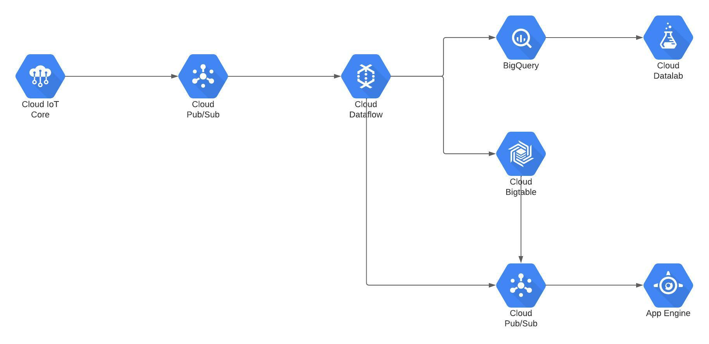

# G3_DP2
## Data Project 2 IoT - Master Data Analytics EDEM 2022
Poner el Logo de la empresa

## Meet our team

- [Laura Macías](https://github.com/LauraMacias)
- [Cristian Medina](hhttps://github.com/medinaltbx)
- [Malena Martin]()
- [Miguel Ruiz]()
- [Jose Luis Rodriguez](https://github.com/joselra98)
- [Alejandro Pérez](https://github.com/AlexPC23)

## Proyecto

El proyecto tiene como objetivo principal la creación de un producto relacionado con el mundo IOT. 

Para ello hemos creado la empresa aParkAp, la cual, nace con la intención de dar a todos sus usuarios una mayor facilidad y agilidad a la hora de buscar aparcamientos en los diferentes parkings del territorio de valencia, y de desarrollar una solución Power BI par las empresas gestoras de estos establecimientos con las que poder controlar y tomar decisiones de forma más sencilla sobre su negocio. 

## Ideas
* **Smart Parking System:**
    * Duración del estacionamiento.
    * Si el aparcamiento está completo, la puerta de entrada estará bloqueada.
    * Los clientes del parking pueden acceder información de parkings disponibles y la predicción de disponibilidad futura. 
    * Añadir sostenibilidad.
    * Pago automático.
    * Reserva de aparcamiento.
    
    
- **TAREAS PRINCIPALES ANTES DEL DP SESION**:

    * Mockup arquitectura cloud -- Cristian, Miguel 
    * Idea de negocio -- Malena, Jose Luis 
    * Target / Público objetivo -- Alex, Laura
    * Financiació Costes -- Jose Luis, Malena
    * Nombre y logo -- Malena
        - aParkApp
    * Definición/Justificación del producto frente a competidores. -- Alex, Laura

## Mockup de arquitectura

