# G3_DP2
## Data Project 2 IoT - Master Data Analytics EDEM 2022
 


## Meet our team

- [Laura Macías](https://github.com/LauraMacias)
- [Cristian Medina](hhttps://github.com/medinaltbx)
- [Malena Martin](https://github.com/MalenaMDH)
- [Miguel Ruiz](https://github.com/miruimi)
- [Jose Luis Rodriguez](https://github.com/joselra98)
- [Alejandro Pérez](https://github.com/AlexPC23)

## Descripción

El proyecto tiene como objetivo principal la creación de un producto relacionado con el mundo IOT, en el que, la solución sea escalable, open source y cloud. 

Para ello hemos creado la empresa aParkAp, la cual, nace con la intención de dar a todos sus usuarios una mayor facilidad y agilidad a la hora de buscar aparcamientos en los diferentes parkings del territorio de valencia, y de desarrollar una solución Power BI par las empresas gestoras de estos establecimientos con las que poder controlar y tomar decisiones de forma más sencilla sobre su negocio. 

## Estructura del proyecto:
```
│   README.md
│   setup_dependencies.txt          # Librerías necesarias para el entorno virtual
│
├───01_IoTCore
│       parkingDeviceData.py        # Emulador de datos IoT
│
├───02_Dataflow
│   │   DataflowCode.py             # Código de ejecución para la pipeline
│   │   Dockerfile                  # Archivo de creación de la imagen template
│   │   requirements.txt            # Librerías necesarias para el contenedor
│   │
│   └───schemas
│           iotToBigQuery.json      # Archivo con esquema de datos IoT
│
├───03_CloudFunctions
│       calculateTimeCloud.py       # Lógica de calculo de tiempos y precios
│       requirements.txt            # Librerías necesarias en Cloud Functions
│
├───images
│
└───info
        useful.txt                  # Archivo de texto con diferentes comandos útiles
```

## Prerrequisitos:

1. En primer lugar, deberemos contar con una [cuenta de GCP](https://cloud.google.com/free/?utm_source=google&utm_medium=cpc&utm_campaign=emea-none-all-none-dr-sitelink-all-all-trial-e-gcp-1011340&utm_content=text-ad-none-any-DEV_c-CRE_526889180785-ADGP_Hybrid%20%7C%20BKWS%20-%20EXA%20%7C%20Txt%20~%20GCP%20~%20General%23v2-KWID_43700060384861660-aud-606988878894%3Akwd-87853815-userloc_1005545&utm_term=KW_gcp-ST_gcp-NET_g-&gclid=CjwKCAiA1JGRBhBSEiwAxXblweeQL5m3raLU4_MpexJyCDpQMEF2bM5NzEcUx7MFyTD0nneu2jC3kRoCs5wQAvD_BwE&gclsrc=aw.ds).

2. Creamos un nuevo proyecto, en nuestro caso se llamará aParkApp:


3. Accedemos al shell de google cloud y clonamos el repositorio:
```
git clone https://github.com/medinaltbx/G3_DP2.git
```

4. Una vez clonado el repositorio, activamos todas las APIs que utilizaremos más adelante. Esto sólo será necesario hacerlo una vez:
```
gcloud services enable dataflow.googleapis.com
gcloud services enable cloudiot.googleapis.com
gcloud services enable cloudbuild.googleapis.com
```

5. Al finalizar la instalación, creamos un entorno virtual sobre el que instalaremos las dependencias necesarias:
```
virtualenv -p python3 parking
source parking/bin/activate
```

6. Accedemos al proyecto e instalamos las librerías:

```
cd G3_DP2
pip install -U -r setup_dependencies.txt
```

## Pub/Sub:
A continuación prepararemos los dos topics sobre los que se transmitirán los mensajes:
* **iotToBigQuery:** Datos emitidos por los sensores de aparcamiento físicos.
* **iotToCloudFunctions:** Datos a procesar para el cálculo de precio en Cloud Functions.

1. En primer lugar crearemos el topic de recepción de mensajes en crudo. Nos dirigimos a [Pub/Sub]('https://cloud.google.com/pubsub) y presionamos "Crear tema". Introducimos "iotToBigQuery" y presionamos "crear tema" de nuevo.

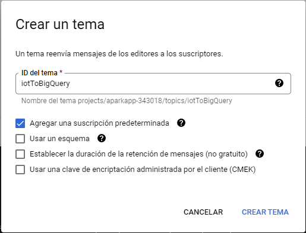

2. Realizamos la misma operación para el topic "iotToCloudFunctions".


## IoT Core:

Para la recepción y gestión de los mensajes emitidos por los diferentes sensores de aparcamiento físicos instalados en los diferentes aparcamientos usaremos [IoT Core]('https://cloud.google.com/iot-core'). En nuestro caso simularemos los datos emitidos por un solo parking.

1. Nos dirigimos a la página de IoT Core y pulsamos "Crear registro". En ella, seleccionamos los siguientes campos:
* **ID del registro:** parkingRegistry
* **Región:** europe-west1
* **Temas de Cloud Pub/Sub**: projects/INTRODUCIR_TU_ID_DE_PROYECTO/topics/iotToBigQuery

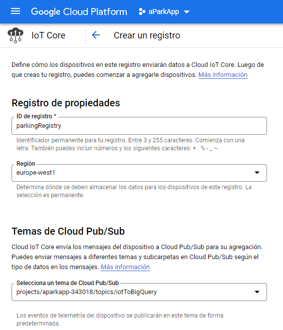

2. A continuación, nos desplazamos a la pestaña de dispositivos y pulsamos "Crear un dispositivo". Lo llamamos "parking1" y pulsamos "Comunicación, cloud logging y autenticación". En "Formato de clave pública" seleccionamos 
RS256_X509.


3. En el cloud shell, nos dirigimos a la carpeta G3_DP2/01_IoTCore e introducimos el siguiente comando:
```
openssl req -x509 -nodes -newkey rsa:2048 -keyout rsa_private.pem -out rsa_cert.pem -subj "/CN=unused"
```

4. Mostramos el contenido del archivo rsa_cert.pem por consola:
```
cat rsa_cert.pem
```
Copiamos lo mostrado, lo pegamos en el campo "Valor de la clave pública" y pulsamos "Crear".

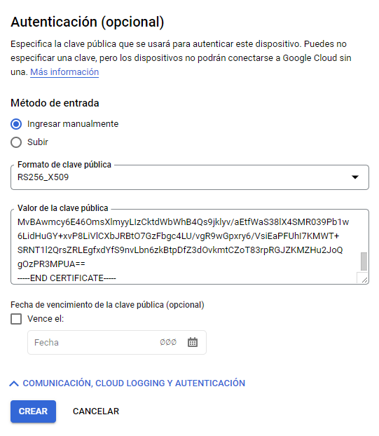

## Cloud Storage:

Debemos preparar un entorno que nos permita guardar los templates de Google Dataflow. Para ello recurriremos a un bucket de Cloud Storage.

1. Accedemos a la página de [Google Storage]('https://console.cloud.google.com/storage/browser) y presionamos "Crear Bucket".

2. Lo llamaremos como nos plazca ya que el identificador ha de ser único. En nuestro caso lo nombramos "iot-cloud-storage-parking".

3. Seleccionamos "Multi-region" y "eu" en los campos de "Ubicación" y "Tipo de ubicación" respectivamente y presionamos "Crear".

## Dataflow:

Utilizaremos [Google Dataflow]('https://cloud.google.com/dataflow') para definir las pipelines de adquisición y transformación de datos.

1. Accedemos al modo editor de la consola cloud y abrimos el archivo 02_Dataflow/DataflowCode.py.


2. En la última línea de código, es necesario introducir el id del proyecto actual en la zona indicada en la imagen inferior. En caso de dejar el mostrado no funcionará:

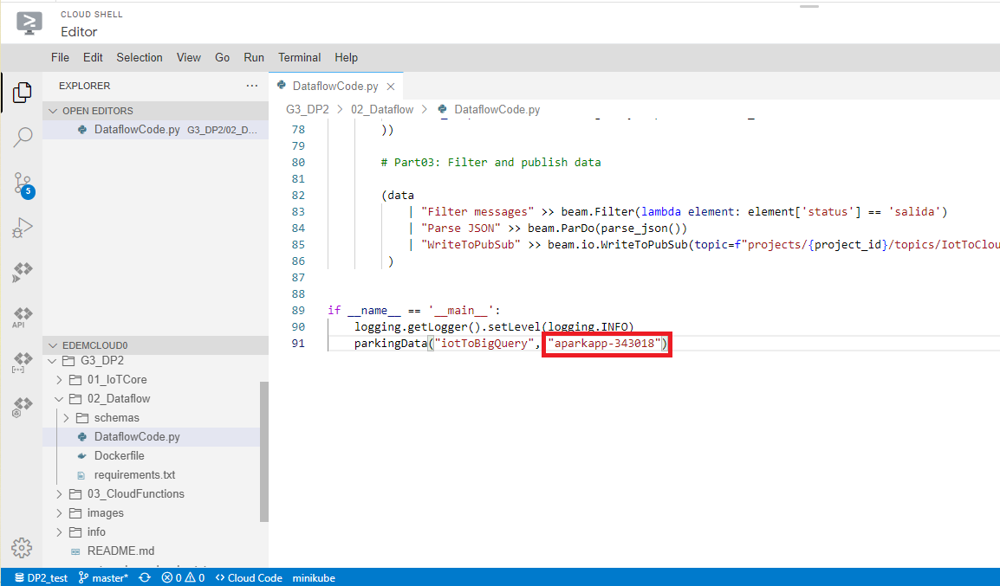

Nos aseguramos de guardar los cambios y volvemos a la terminal pulsando "Abrir terminal".

3. Nos dirigimos a la carpeta /G3_DP2/02_Dataflow y ejecutamos los siguientes comandos, completándolos pertinentemente:

```
gcloud builds submit --tag 'gcr.io/<TU_ID_DE_PROYECTO>/dataflow/parking:latest' .

gcloud dataflow flex-template build "gs://<TU_ID_DE_BUCKET>/dataflowtemplate.json" \
  --image "gcr.io/<TU_ID_DE_PROYECTO>/dataflow/parking:latest" \
  --sdk-language "PYTHON" 

gcloud dataflow flex-template run "parking-dataflow-job" \
    --template-file-gcs-location "gs://<TU_ID_DE_BUCKET>/dataflowtemplate.json" \
    --region "europe-west1"
```

Si todo ha ido bien, en este punto Dataflow ya se encuentra preparado para recibir mensajes de los dispositivos. Observaremos un gráfico de flujo de ejecución como el siguiente:

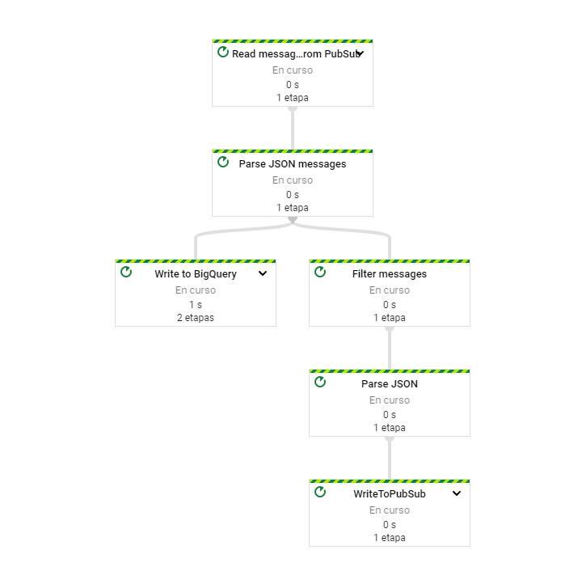

## Cloud Functions:

Para la lógica de control de salidas y precios utilizaremos [Google Cloud Functions]("https://console.cloud.google.com/functions/list").

1. Nos dirigimos a la página de Cloud Functions y presionamos "Crear función". Rellenaremos los campos como observamos en la imagen siguiente:

* **Nombre de la función**: calculate_time
* **Región:** europe-west1
* **Activador:** Cloud Pub/Sub -->
    projects/aparkapp-343018/topics/iotToCloudFunctions


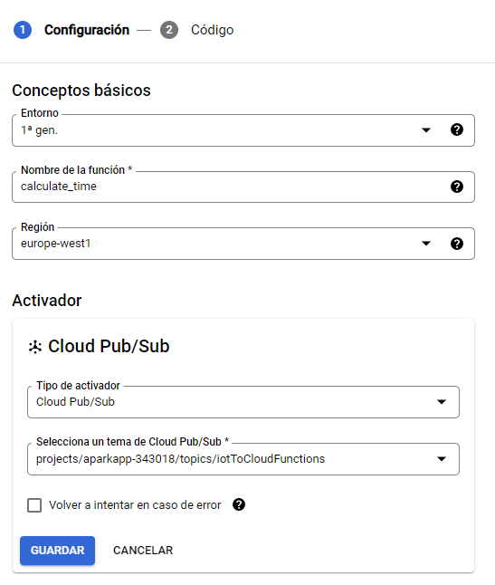

Pulsamos "Guardar" y "Siguiente".

2. A continuación deberemos seleccionar Python 3.7 en el desplegable "Entorno de ejecución" e ingresar "calculate_time" en el campo "Punto de entrada". Posteriormente, copiamos el código ubicado en G3_DP2/03_CloudFunctions/calculateTimeCloud.py dentro del campo editable:

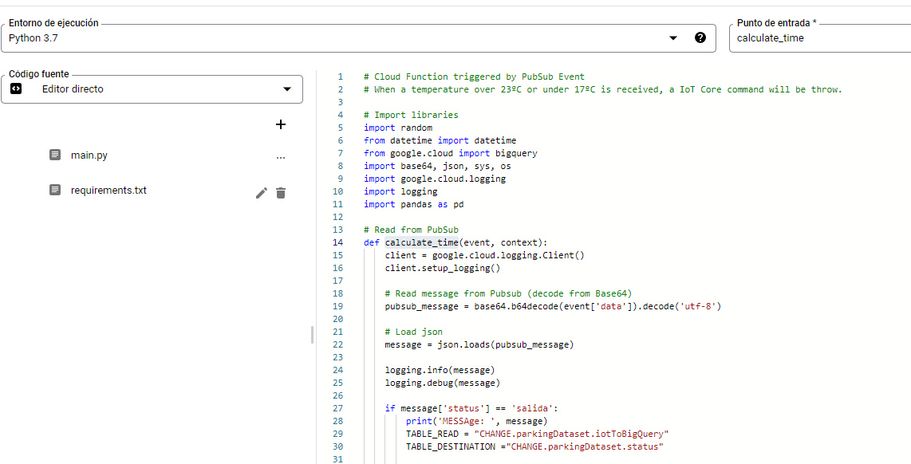

#### MUY IMPORTANTE: Es necesario cambiar el identificador del proyecto DENTRO del código. Concretamente en las líneas 29 y 30:
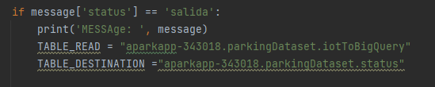

3. Por último, ingresamos las siguientes librerías dentro del archivo requirements.txt y pulsamos "Implementar":

```
pandas
google-cloud-logging
google-cloud-bigquery
datetime
pyarrow
```

En caso de que no haya ocurrido ningún error durante la implementación de la función, en este punto ya está todo listo para lanzar nuestro sistema a tiempo real.


## Ejecución:

1. Desde la terminal nos dirigimos a la carpeta 01_IoTCore. En ella, introducimos el siguiente comando cambiando aquellos campos necesarios:
```
python parkingDeviceData.py \
    --algorithm RS256 \
    --cloud_region europe-west1 \
    --device_id parking1 \
    --private_key_file rsa_private.pem \
    --project_id <TU_ID_DE_PROYECTO> \
    --registry_id parkingRegistry
```

2. Ejecutamos el comando y debemos observar unos mensajes por pantalla como los siguientes:

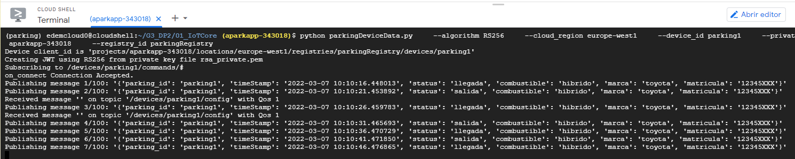

3. Dejamos que emita varios mensajes y nos dirigimos a Big Query para comprobar que todo se está ejecutando correctamente:

* **iotToBigQuery**:

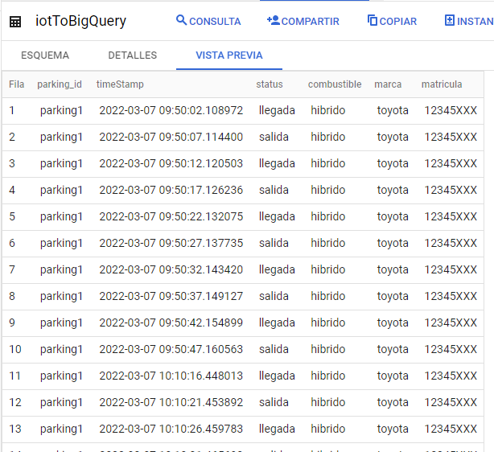

* **status:**

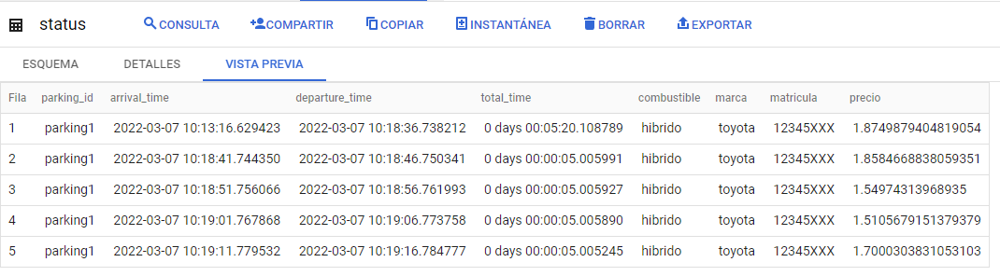