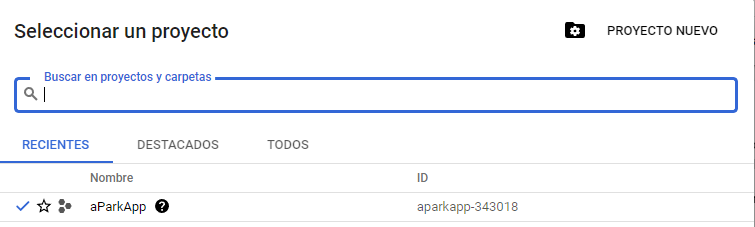
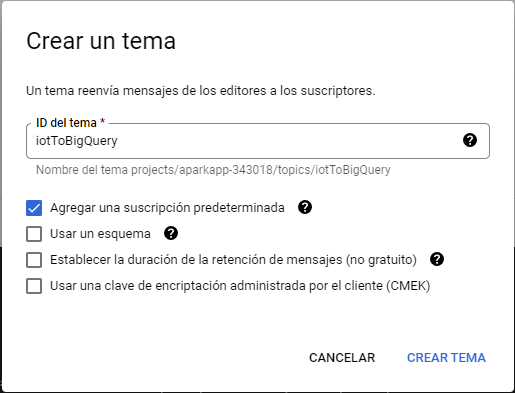

# G3_DP2
## Data Project 2 IoT - Master Data Analytics EDEM 2022
 


## Meet our team

- [Laura Macías](https://github.com/LauraMacias)
- [Cristian Medina](hhttps://github.com/medinaltbx)
- [Malena Martin](https://github.com/MalenaMDH)
- [Miguel Ruiz](https://github.com/miruimi)
- [Jose Luis Rodriguez](https://github.com/joselra98)
- [Alejandro Pérez](https://github.com/AlexPC23)

## Proyecto

El proyecto tiene como objetivo principal la creación de un producto relacionado con el mundo IOT, en el que, la solución sea escalable, open source y cloud. 

Para ello hemos creado la empresa aParkAp, la cual, nace con la intención de dar a todos sus usuarios una mayor facilidad y agilidad a la hora de buscar aparcamientos en los diferentes parkings del territorio de valencia, y de desarrollar una solución Power BI par las empresas gestoras de estos establecimientos con las que poder controlar y tomar decisiones de forma más sencilla sobre su negocio. 

## Estructura del proyecto:
```bash
```

## Prerrequisitos:

1. En primer lugar, deberemos contar con una [cuenta de GCP](https://cloud.google.com/free/?utm_source=google&utm_medium=cpc&utm_campaign=emea-none-all-none-dr-sitelink-all-all-trial-e-gcp-1011340&utm_content=text-ad-none-any-DEV_c-CRE_526889180785-ADGP_Hybrid%20%7C%20BKWS%20-%20EXA%20%7C%20Txt%20~%20GCP%20~%20General%23v2-KWID_43700060384861660-aud-606988878894%3Akwd-87853815-userloc_1005545&utm_term=KW_gcp-ST_gcp-NET_g-&gclid=CjwKCAiA1JGRBhBSEiwAxXblweeQL5m3raLU4_MpexJyCDpQMEF2bM5NzEcUx7MFyTD0nneu2jC3kRoCs5wQAvD_BwE&gclsrc=aw.ds).

2. Creamos un nuevo proyecto, en nuestro caso se llamará aParkApp:



3. Accedemos al shell de google cloud y clonamos el repositorio:
```
git clone https://github.com/medinaltbx/G3_DP2.git
```

4. Una vez clonado el repositorio, activamos todas las APIs que utilizaremos más adelante. Esto sólo será necesario hacerlo una vez:
```
gcloud services enable dataflow.googleapis.com
gcloud services enable cloudiot.googleapis.com
gcloud services enable cloudbuild.googleapis.com
```

5. Al finalizar la instalación, creamos un entorno virtual sobre el que instalaremos las dependencias necesarias:
```
virtualenv -p python3 parking
source parking/bin/activate
```

6. Accedemos al proyecto e instalamos las librerías:

```
cd G3_DP2
pip install -U -r setup_dependencies.txt
```

## Pub/Sub:
A continuación prepararemos los dos topics sobre los que se transmitirán los mensajes:
* **iotToBigQuery:** Datos emitidos por los sensores de aparcamiento físicos.
* **iotToCloudFunctions:** Datos a procesar para el cálculo de precio en Cloud Functions.

1. En primer lugar crearemos el topic de recepción de mensajes en crudo. Nos dirigimos a [Pub/Sub]('https://cloud.google.com/pubsub) y presionamos "Crear tema". Introducimos "iotToBigQuery" y presionamos "crear tema" de nuevo.



2. Realizamos la misma operación para el topic "iotToCloudFunctions".


## IoTCore:

Para la recepción y gestión de los mensajes emitidos por los diferentes sensores de aparcamiento físicos instalados en el parking usaremos [IoTCore]('https://cloud.google.com/iot-core'). En nuestro caso simularemos los datos emitidos por un solo parking.

1.

